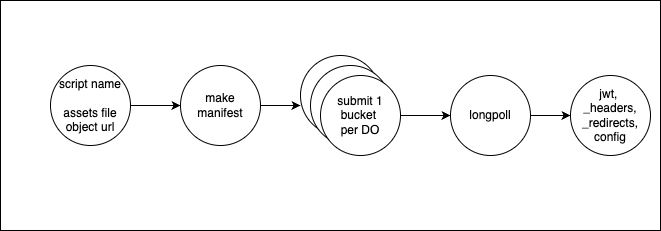

# Get Asset Manifest

- Package finds assets in file object
- cli: Does that in current folder

```
npx getassetmanifest
```



Uploads to cloudflare

- Uses Cloudflare's Direct Upload API flow (https://developers.cloudflare.com/workers/static-assets/direct-upload)
- Implements parallel bucket uploads via Durable Objects for maximum speed (❌ removed the parallel nature of it since it was buggy)
- Supports both content and binary files
- Handles `wrangler.toml/json/jsonc` parsing to find assets location, applies `.assetsignore` filtering, with default fallback to root if no wrangler-file is present
- Returns JWT for final deployment step

TODO:

- ✅ Ensure to find and return `_headers, _redirects` in assets root
- ✅ Turn into package and cli as well
- Create a test repo with lot of assets
- Benchmark: measure speed
