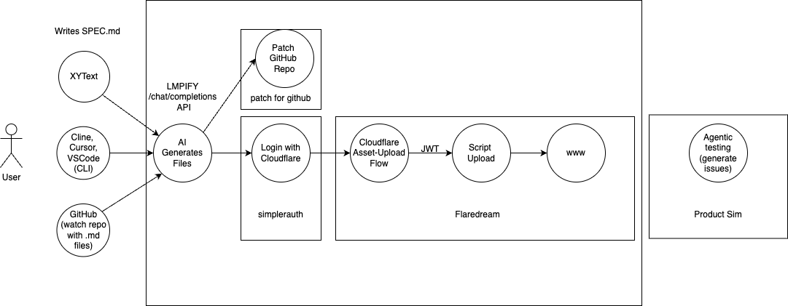

Context:

Reverse engineer wrangler:
`WRANGLER_LOG=debug WRANGLER_LOG_SANITIZE=false wrangler deploy`

Thread: https://x.com/janwilmake/status/1945030532959445166

Wht wrangler does: https://letmeprompt.com/httpspastebincon-jae96v0

What wrangler does: https://httpspastebincon-jae96v0.letmeprompt.com/result
Newer way, 2 steps:
https://oapis.org/openapi/cloudflare/worker-versions-upload-version
https://oapis.org/openapi/cloudflare/worker-deployments-create-deployment

Traditional, faster:
https://oapis.org/openapi/cloudflare/worker-script-upload-worker-module

What wrangler does when doing a version deployment (interestingly it returns `script_runtime`):
https://letmeprompt.com/httpsuithubcomj-b0at840

"https://api.cloudflare.com/client/v4/accounts/080fd9e0587416d2fa30ed1f527e2323/workers/scripts/flaredream-upload/versions/6d5c709e-ef3e-48fe-948b-b9d5ae5c8068"

Response snippet:

```json
"script_runtime": {
  "migration_tag": "v1",
  "compatibility_date": "2025-06-29",
  "usage_model": "standard"
}
```

X

- Asset upload process https://developers.cloudflare.com/workers/static-assets/direct-upload/index.md
- https://unpkg.com/wrangler@latest/config-schema.json

Routing wrangler and apis

https://letmeprompt.com/httpsuithubcomj-b1ct360
https://letmeprompt.com/httpsuithubcomj-b1ct360.md?key=result

CF Docs on routing:

https://developers.cloudflare.com/workers/configuration/routing/custom-domains/index.md
https://developers.cloudflare.com/workers/configuration/routing/index.md
https://developers.cloudflare.com/workers/configuration/routing/routes/index.md
https://developers.cloudflare.com/workers/configuration/routing/workers-dev/index.md
https://developers.cloudflare.com/workers/wrangler/configuration/index.md

wrangler source code related to routing:
https://pastebin.contextarea.com/hzMhg3D.md

better: https://uuithub.com/cloudflare/workers-sdk/tree/main/packages/wrangler/src?excludePathPatterns=**%2F__tests__%2F**&excludePathPatterns=**%2F__snapshots__%2F**&excludePathPatterns=**%2Ftest%2F**&excludePathPatterns=**%2Ftests%2F**&excludePathPatterns=**%2Ffixtures%2F**&excludePathPatterns=**%2F*.test.ts&excludePathPatterns=**%2F*.spec.ts&excludePathPatterns=**%2F*.test.js&excludePathPatterns=**%2F*.spec.js&excludePathPatterns=.changeset%2F**&excludePathPatterns=.github%2F**&excludePathPatterns=.vscode%2F**&excludePathPatterns=fixtures%2F**&excludePathPatterns=e2e%2F**&excludePathPatterns=patches%2F**&excludePathPatterns=tools%2F**&excludePathPatterns=*.md&excludePathPatterns=*.png&excludePathPatterns=*.jpg&excludePathPatterns=*.svg&excludePathPatterns=*.ico&excludePathPatterns=*.gif&excludePathPatterns=*.bin&excludePathPatterns=*.wasm&excludePathPatterns=*.wat&excludePathPatterns=*.lock&excludePathPatterns=*.yaml&excludePathPatterns=*.yml&excludePathPatterns=*.json&excludePathPatterns=*.jsonc&excludePathPatterns=*.toml&excludePathPatterns=*.config.*&excludePathPatterns=*.setup.*&excludePathPatterns=tsconfig.*&excludePathPatterns=vitest.*&excludePathPatterns=turbo.json&excludePathPatterns=package.json&excludePathPatterns=wrangler.json*&excludePathPatterns=.env*&excludePathPatterns=.git*&excludePathPatterns=.eslint*&excludePathPatterns=.prettier*&excludePathPatterns=.nvmrc&excludePathPatterns=.node-version&excludePathPatterns=LICENSE*&excludePathPatterns=CHANGELOG*&excludePathPatterns=CONTRIBUTING*&excludePathPatterns=SECURITY*&excludePathPatterns=STYLEGUIDE*&excludePathPatterns=CODEOWNERS&excludePathPatterns=CODE_OF_CONDUCT*&excludePathPatterns=README*&excludePathPatterns=**%2Fnode_modules%2F**&excludePathPatterns=**%2Fdist%2F**&excludePathPatterns=**%2Fbuild%2F**&excludePathPatterns=**%2Fcoverage%2F**&excludePathPatterns=packages%2Fchrome-devtools-patches%2F**&excludePathPatterns=packages%2Fcloudflare-workers-bindings-extension%2F**&excludePathPatterns=packages%2Fcli%2F**&excludePathPatterns=packages%2Fcontainers-shared%2F**&excludePathPatterns=packages%2Fcreate-cloudflare%2F**&excludePathPatterns=packages%2Fdevprod-status-bot%2F**&excludePathPatterns=packages%2Fedge-preview-authenticated-proxy%2F**&excludePathPatterns=packages%2Feslint-config-worker%2F**&excludePathPatterns=packages%2Fformat-errors%2F**&excludePathPatterns=packages%2Fkv-asset-handler%2F**&excludePathPatterns=packages%2Fminiflare%2F**&excludePathPatterns=packages%2Fmock-npm-registry%2F**&excludePathPatterns=packages%2Fpages-shared%2F**&excludePathPatterns=packages%2Fplayground-preview-worker%2F**&excludePathPatterns=packages%2Fquick-edit-extension%2F**&excludePathPatterns=packages%2Fquick-edit%2F**&excludePathPatterns=packages%2Fsolarflare-theme%2F**&excludePathPatterns=packages%2Fturbo-r2-archive%2F**&excludePathPatterns=packages%2Funenv-preset%2F**&excludePathPatterns=packages%2Fvite-plugin-cloudflare%2F**&excludePathPatterns=packages%2Fvitest-pool-workers%2F**&excludePathPatterns=packages%2Fworkers-editor-shared%2F**&excludePathPatterns=packages%2Fworkers-playground%2F**&excludePathPatterns=packages%2Fworkers-tsconfig%2F**&excludePathPatterns=packages%2Fworkers.new%2F**&excludePathPatterns=packages%2Fworkflows-shared%2F**

Based on the OpenAPI specification provided, here's a table of the Worker Routes endpoints:

REGULAR TRADITIONAL ROUTING ENDPOINTS

https://oapis.org/openapi/cloudflare/worker-routes-list-routes
https://oapis.org/openapi/cloudflare/worker-routes-create-route
https://oapis.org/openapi/cloudflare/worker-routes-get-route
https://oapis.org/openapi/cloudflare/worker-routes-update-route
https://oapis.org/openapi/cloudflare/worker-routes-delete-route

CUSTOM DOMAIN ROUTES

https://developers.cloudflare.com/workers/configuration/routing/custom-domains/index.md
https://oapis.org/openapi/cloudflare/worker-domain-list-domains
https://oapis.org/openapi/cloudflare/worker-domain-attach-to-domain
https://oapis.org/openapi/cloudflare/worker-domain-get-a-domain
https://oapis.org/openapi/cloudflare/worker-domain-detach-from-domain

Get/set the subdomain:

- https://oapis.org/openapi/cloudflare/worker-subdomain-get-subdomain
- https://oapis.org/openapi/cloudflare/worker-script-get-subdomain
- https://oapis.org/openapi/cloudflare/worker-script-post-subdomain

- Find zone ID from hostname: https://oapis.org/openapi/cloudflare/zones-get
- https://oapis.org/openapi/cloudflare/worker-routes-create-route



Settings-related endpoints:

- worker-script-environment-get-settings - Get Script Settings ( Spec: https://oapis.org/openapi/cloudflare/worker-script-environment-get-settings )
- namespace-worker-script-worker-details - Worker Details ( Spec: https://oapis.org/openapi/cloudflare/namespace-worker-script-worker-details )
- worker-script-get-content - Get script content ( Spec: https://oapis.org/openapi/cloudflare/worker-script-get-content )
- worker-script-settings-get-settings - Get Script Settings ( Spec: https://oapis.org/openapi/cloudflare/worker-script-settings-get-settings )
- worker-script-get-settings - Get Settings ( Spec: https://oapis.org/openapi/cloudflare/worker-script-get-settings )
- worker-script-environment-get-settings - Get Script Settings ( Spec: https://oapis.org/openapi/cloudflare/worker-script-environment-get-settings )

which one do I need to get the current latest worker migration tag? for each endpoint, tell me what they return regarding migrations: answer: https://letmeprompt.com/httpsuithubcomj-98gpbs0

To get migrations: worker-script-get-settings - Get Settings ( Spec: https://oapis.org/openapi/cloudflare/worker-script-get-settings )

This is all that's needed.

Useful POC:

- no assets
- no bindings (except DOs)
- hardcode secrets in metadata for now
- no module stuff and typescript, skipping build process

Cloudflare worker that:

- Landingpage shows instructions and button to login. super minimal HTML without CSS and mostly semantic html. If logged in, no login button, rather, an input to fill the url leading to `/{url}`
- `/login` requests basic auth via www-auth where username is account-id and password is API Key. If already logged, back to `/`
- `/{url}` will:
  - Fetch the script at url
  - determine the name of the script (last segment without extension)
  - Extract everything between `export const metadata =` until `;`
  - Parse that as JSON (https://pastebin.contextarea.com/tD4Mu9S.md)
  - Add account ID and api key and perform api calls to create route(s) and upload worker (https://oapis.org/openapi/cloudflare/worker-script-upload-worker-module https://oapis.org/openapi/cloudflare/worker-routes-create-route)
- Upon successful deployment, redirect to the worker

# Previous work

https://github.com/janwilmake/flareoncloud

https://github.com/janwilmake/evaloncloud.proxy/blob/main/ADR.md

https://github.com/janwilmake/monoflare.wrapfetch

https://github.com/stars/janwilmake/lists/serverless-deployment (It's a lot)

# ✅ NEW SPEC

This worker upload is doing just 1 file of a worker

https://pastebin.contextarea.com/EmSPepF.md
https://uithub.com/janwilmake/wrangler-convert/blob/main/README.md
https://upload.flaredream.com/openapi.json

Update this such that:

1. takes a URL-encoded URL that returns a files object JSON, format is `{ files: { [path:string]: { type:"content"|"binary", url?:string, content?:string, hash:string, size:number } }`
2. finds and parses wrangler.toml or json or jsonc (use libraries for this)
3. uses wrangler-convert library to get metadata for upload
4. uploads all assets to upload.flaredream.com (we know the scriptName from metadata
5. uses the JWT returned to upload a script with all assets with the same provided script name. also provide \_headers and \_redirects if available.

Return a new implementation that does this. use typescript
